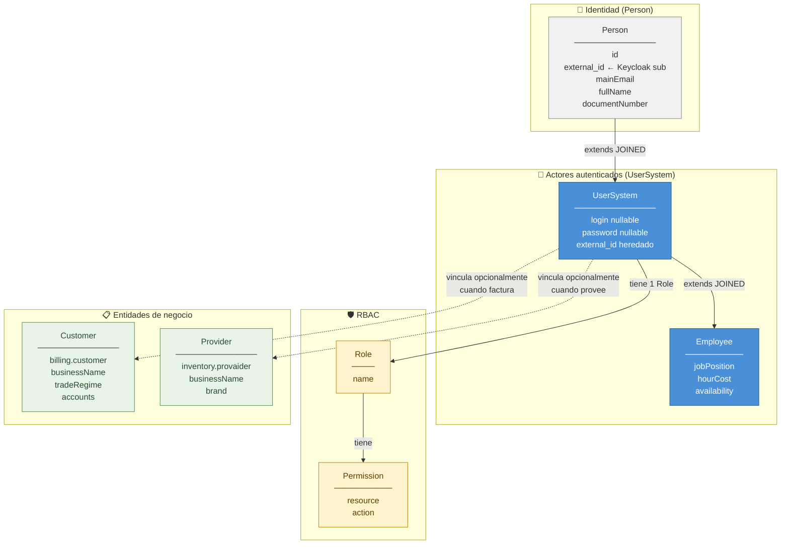
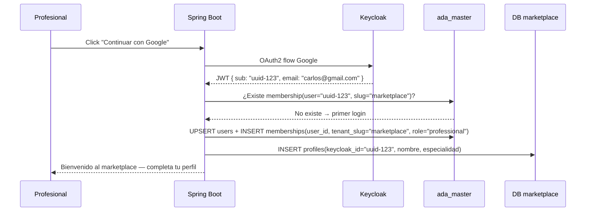
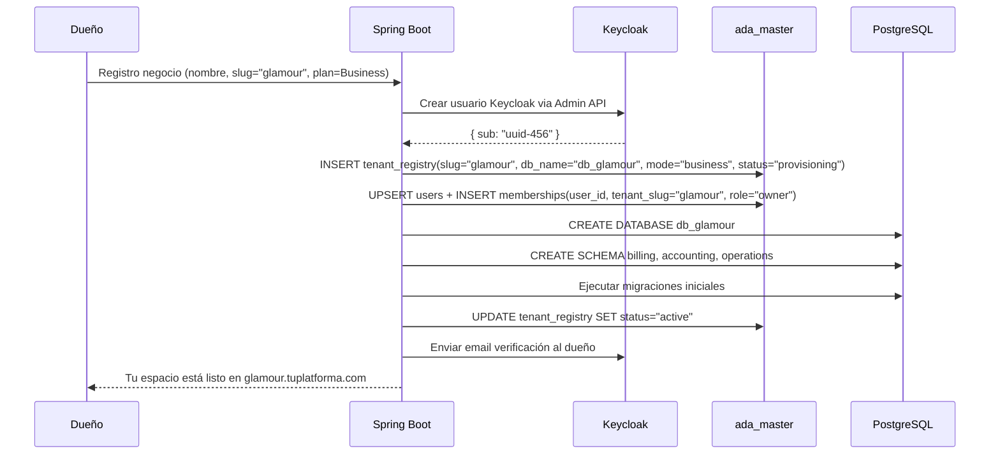
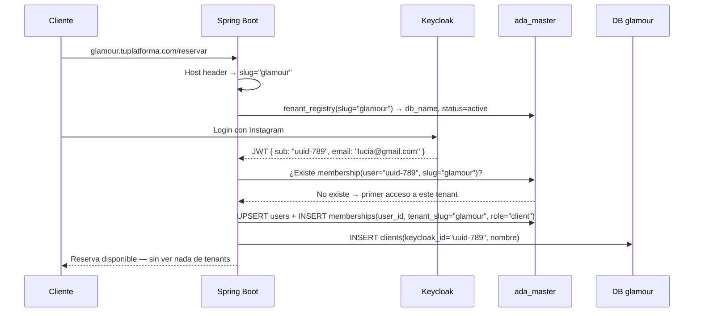
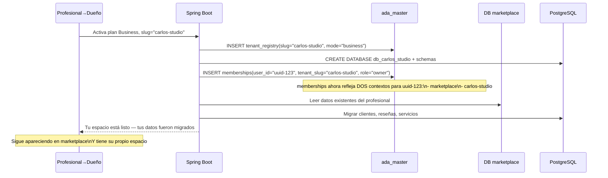
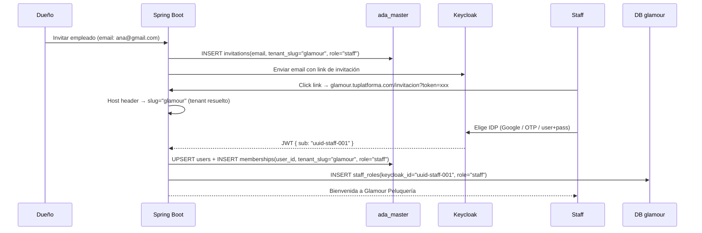
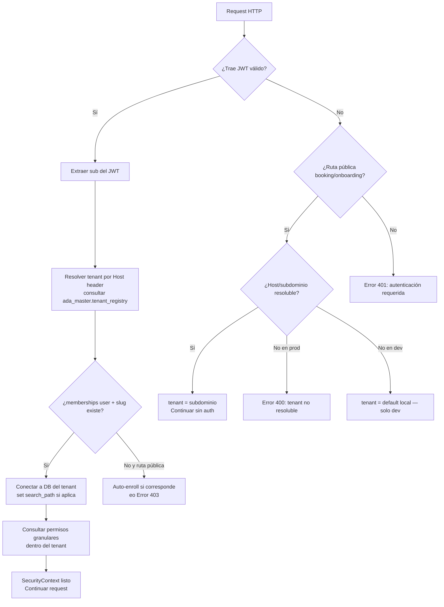
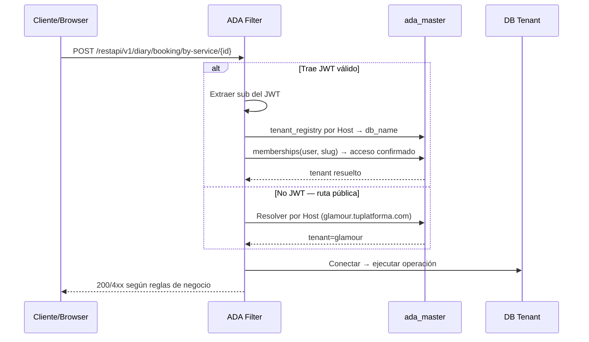

# Tenant Context Architecture (Booking-first)

## Objetivo

Definir una regla única, simple y consistente para resolver el tenant por request, alineada con:

- UX friendly (el usuario no introduce tenant manualmente).
- Arquitectura real actual: monolito ADA + frontend complementario en evolución.
- Keycloak como proveedor de identidad y autenticación global — solo hace lo que hace bien.
- Identidad federada: una persona, múltiples contextos (tenants).
- Resolución de tenant por dominio/subdominio cuando aplique.
- Modelo híbrido: marketplace compartido + tenant con DB propia según plan.

Este documento toma como **canónico** el diseño objetivo de la UH y separa explícitamente el **estado actual implementado** para evitar ambigüedad.

Referencia funcional principal:
- [`user-histories/active/uh-00-START-HERE-multitenant.md`](user-histories/active/uh-00-START-HERE-multitenant.md)
- Estado de todas las UHs: [`user-histories/INDEX.md`](user-histories/INDEX.md)

---

## Responsabilidades por capa

Cada capa tiene una responsabilidad única y no invade la de las demás.

| Capa | Responsabilidad | No hace |
|---|---|---|
| **Keycloak** | Identidad global, autenticación, sesiones, social login, OTP, emisión de JWT | Roles de negocio, membresías por tenant, permisos granulares |
| **ada_master** | Routing de tenants, membresías globales, configuración UI (bundles) | Lógica de negocio, permisos internos del tenant |
| **DB por tenant** | Roles granulares, permisos internos, datos de negocio | Identidad, autenticación |

---

## Modelo de actores — herencia RBAC unificada

Todos los actores que operan dentro de un tenant son subclases de `UserSystem`. `UserSystem` es el **sujeto RBAC universal** — tiene `Role` con sus permisos, pero sus credenciales internas (`login`/`password`) son **opcionales** para no forzar la capa de autenticación en actores que delegan a Keycloak.



**Lectura del diagrama:**

- `UserSystem` es el **único sujeto de autenticación y RBAC**. Cualquier persona que tenga login en el sistema (interno u OAuth) pasa por aquí.
- `Employee` **hereda de `UserSystem`** (✅ implementado — migración 022 aplicada 2026-05-02).
- `Customer` y `Provider` **no heredan** de `UserSystem` — son entidades de negocio (contable / inventario) que pueden existir sin login. La asociación es **opcional** via `user_system_id nullable`.

**Ciclo de vida de una misma persona real:**

```
1. María se registra con Google
   → UserSystem creado (external_id = sub, login = NULL)

2. María reserva un turno
   → UserSystem usado directamente (RBAC role = CLIENT)

3. María recibe su primera factura
   → Customer creado (businessName, tradeRegime...)
   → Customer.user_system_id = maría.id

4. Don José provee insumos Y tiene acceso al portal
   → Provider creado (businessName = "Distribuidora José")
   → Provider.user_system_id = jose.id  ← activa acceso
   → Si es proveedor externo sin portal: user_system_id = NULL
```

**Migración aplicada (2026-05-02):**

```sql
-- 023-business-entities-link-to-usersystem.sql — ya aplicada
ALTER TABLE billing.customer
  ADD COLUMN IF NOT EXISTS user_system_id BIGINT REFERENCES public.user_system(id) ON DELETE SET NULL;

ALTER TABLE inventory.provaider
  ADD COLUMN IF NOT EXISTS user_system_id BIGINT REFERENCES public.user_system(id) ON DELETE SET NULL;
```

### Regla de identidad por tipo de actor

| Actor | AuthN | `login`/`password` | `external_id` | Obtiene RBAC fino |
|---|---|---|---|---|
| Admin/staff interno | Credentials en DB | ✅ required | NULL | ✅ vía `UserSystem.role` |
| Profesional OAuth | Keycloak / Google / OTP | NULL | ✅ `sub` Keycloak | ✅ vía `UserSystem.role` |
| Cliente OAuth | Keycloak / Google / OTP | NULL | ✅ `sub` Keycloak | ✅ vía `UserSystem.role` |

### Por qué `UserSystem` como base universal (no `Person` directo)

Si `Employee` o `Client` extendieran `Person` directamente (como estaba antes), necesitarían cada uno su propio FK a `public.role` para tener permisos. Al centralizar en `UserSystem`, el RBAC es una consecuencia de **ser un actor**, no de ser un tipo específico de actor.

### `Employee.role` — cargo laboral, no RBAC

`Employee.job_position` (hoy llamado `role VARCHAR(100)`) representa el **cargo organizacional** del empleado dentro del negocio: `"Gerente de operaciones"`, `"Colorista"`, `"Recepcionista"`. El valor por defecto en el código es `"Employee"`. Este campo es semánticamente correcto tal como está — **no es un intento de RBAC**.

El RBAC falta porque `Employee` aún no llega a `UserSystem`. Son dos conceptos distintos que coexisten en el mismo actor:

| Campo | Semántica | Dónde debe vivir |
|---|---|---|
| `job_position` | Cargo laboral visible en UI | `employee` (✅ renombrado de `role`) |
| `role` (FK) | Permisos del sistema | heredado de `UserSystem` (✅ implementado) |

**Correcciones aplicadas (2026-05-02):**

1. ✅ `Employee extends UserSystem` (era `extends Person`) — migración 022
2. ✅ `login` y `password` nullable en `public.user_system` — migración 021
3. ✅ `employee.role` renombrado a `employee.job_position` — migración 022

ADR: [`.ai/decisions/2026-05-02-employee-extends-usersystem-rbac.md`](../.ai/decisions/2026-05-02-employee-extends-usersystem-rbac.md) — incluye deuda LSP documentada.

### `Customer` (billing) — no requiere alineación a `UserSystem`

`Customer` existe en `org.sotobotero.ada.module.billing.entities`. Es una **entidad contable**, no un actor de autenticación. Representa a la persona o empresa que aparece en facturas, contratos y cuentas — puede ser una empresa jurídica que nunca se loguea en la app.

`Customer` y el actor autenticado son **dos objetos distintos** que a veces coinciden en la misma persona real:

```
María se loguea en la app   →  UserSystem  (autenticación + RBAC)
María paga una factura      →  Customer    (entidad contable, no necesita login)
```

Fusionarlos (`Customer extends UserSystem`) implicaría:
- **Migración destructiva de datos:** cada `billing.customer` existente necesitaría una fila nueva en `public.user_system` — todos los servicios romperían en arranque sin esa migración.
- **Violación de SRP:** mezclaría responsabilidad contable con autenticación.
- `Patient` tiene un FK directo a `Customer` — se vería arrastrado en la migración.

**Decisión:** `Customer` permanece como `extends Person`. El actor OAuth que reserva turnos se maneja como `UserSystem` directamente (o una subclase futura `AppUser extends UserSystem`), con una referencia opcional hacia `Customer` cuando esa persona también tenga historial de facturación.

---

## Estado actual vs objetivo

### Estado actual (implementado hoy)

- El monolito ADA resuelve contexto de tenant por `Host` y por información de request (`JWT` y compatibilidad con `X-TenantID`) en el filter.
- `ada_master` sigue siendo la fuente de verdad para registro de tenants y bundles.
- Los permisos granulares de negocio viven en la base de datos de cada tenant.
- En booking, el aislamiento inicial en datos compartidos se está resolviendo por `professionalId` (estrategia pragmática de arranque).
- No existe todavía una estrategia transversal de aislamiento por `tenant_id` en todas las tablas del dominio.

### Objetivo incremental

- Mantener `booking-first`: primero estabilidad operativa del flujo de reservas.
- Endurecer aislamiento por fases, evitando sobrediseño temprano.
- Evolucionar desde reglas por `professionalId` hacia políticas más robustas cuando el modelo de datos lo soporte de forma transversal.

---

## Keycloak — identidad y autenticación global

Keycloak gestiona exclusivamente:

- Quién eres (identidad única global)
- Cómo te autenticas (Google, Facebook, OTP, user+password)
- Roles generales: `ROLE_USER`, `ROLE_ADMIN`, `ROLE_PROFESSIONAL`
- Claims estándar: `sub`, `email`, `email_verified`
- Scopes: `openid`, `profile`, `email`
- Gestión de sesiones y refresh tokens

Para alinear completamente con la UH, se distinguen dos artefactos:

- **Token de identidad (Keycloak)**: mínimo, sin datos de negocio.
- **Token de aplicación (ADA/Spring)**: enriquecido con contexto de tenant después de resolver `Host` + membresía en `ada_master`.

Ejemplo de token de identidad (Keycloak):

```json
{
  "sub": "uuid-keycloak",
  "email": "maria@gmail.com",
  "email_verified": true,
    "roles": ["ROLE_USER"],
  "scope": "openid profile email"
}
```

Ejemplo de token de aplicación (objetivo UH):

```json
{
    "sub": "uuid-keycloak",
    "user_id": "uuid-global-maria",
    "tenant": "glamour",
    "tenant_mode": "business",
    "role": "staff",
    "exp": 1234567890
}
```

### Por qué `sub` y no email como identificador

El `sub` es el identificador único e inmutable que Keycloak asigna a cada usuario. No cambia aunque el usuario cambie su email o conecte otro social login.

```
María se registra con Google  → sub: "uuid-123", email: maria@gmail.com
María cambia su email          → sub: "uuid-123"  ← no cambia
María conecta Facebook         → sub: "uuid-123"  ← sigue siendo el mismo
```

Si se usara email como FK en ada_master, un cambio de email rompería todas las relaciones. Con `sub` eso nunca ocurre.

### Identity Providers — estado de soporte

| IDP | Soporte en Keycloak | Prioridad | Notas |
|---|---|---|---|
| Google OAuth2 | Nativo | P0 — lanzamiento | Mayor adopción en el segmento |
| OTP por email | Nativo | P0 — lanzamiento | Magic link o código 6 dígitos |
| Usuario + contraseña | Nativo | P0 — lanzamiento | Opción de último recurso |
| Facebook | Nativo | P1 — iteración 2 | Social login |
| Instagram | IDP custom OAuth2 | P2 — iteración 3 | Configuración manual adicional |
| TikTok | IDP custom OAuth2 | P2 — iteración 3 | Configuración manual adicional |

Lanzar con Google + OTP + user/password cubre el 80% de los casos de uso y reduce la complejidad inicial.

---

## ada_master — routing y membresías globales

`ada_master` es la base de datos existente extendida. Responde preguntas que deben resolverse **antes** de conectar contexto de negocio:

```
tenant_registry  → ¿este slug existe? ¿a qué DB apunta? ¿está activo?
users/memberships → ¿este usuario global tiene acceso a este tenant y con qué rol?
bundles          → ¿qué configuración UI aplica a este tenant? (existente)
```

### Estructura requerida (objetivo UH)

```sql
-- Extender tenant_registry existente
ALTER TABLE tenant_registry ADD COLUMN IF NOT EXISTS mode    VARCHAR DEFAULT 'business';
-- 'marketplace' | 'business'
ALTER TABLE tenant_registry ADD COLUMN IF NOT EXISTS db_name VARCHAR;
-- null = base de datos compartida (marketplace), valor = DB propia (business)

-- Identidad global
CREATE TABLE IF NOT EXISTS users (
    id           UUID PRIMARY KEY DEFAULT gen_random_uuid(),
    email        VARCHAR UNIQUE NOT NULL,
    keycloak_id  VARCHAR UNIQUE NOT NULL,
    verified_at  TIMESTAMPTZ,
  created_at   TIMESTAMPTZ DEFAULT now(),
);

-- Membresías globales — una persona, N tenants
CREATE TABLE IF NOT EXISTS memberships (
    id           UUID PRIMARY KEY DEFAULT gen_random_uuid(),
    user_id      UUID NOT NULL REFERENCES users(id),
    tenant_slug  VARCHAR NOT NULL REFERENCES tenant_registry(slug),
    role         VARCHAR NOT NULL,
    status       VARCHAR DEFAULT 'active',
    created_at   TIMESTAMPTZ DEFAULT now(),
    UNIQUE (user_id, tenant_slug)
);
```

Relación con la estructura existente:
- `tenant_registry` ya existe → agregar columnas `mode` y `db_name`
- `bundles` ya existe → sin cambios
- `users` y `memberships` → tablas nuevas para identidad global + acceso multi-tenant
- `user_tenants` puede mantenerse temporalmente como compatibilidad técnica durante migración.

### Por qué membresías en ada_master y no en Keycloak

Keycloak Groups/Roles no escala para miles de tenants:

| Aspecto | Groups en Keycloak | users/memberships en ada_master |
|---|---|---|
| Escala a miles de tenants | Se degrada | Es solo una tabla |
| Onboarding nuevo tenant | Requiere Keycloak Admin API | INSERT en ada_master |
| Keycloak caído | Sin login Y sin membresías | Sin login, membresías disponibles |
| Queries complejas | Imposible | SQL normal |
| Roles granulares de negocio | No aplica | Viven en DB del tenant |

---

## DB por tenant — roles y permisos granulares

Cada tenant con plan Business o superior tiene su propia DB con la siguiente estructura de permisos interna:

```
DB: db_glamour
├── schema billing
├── schema accounting
└── schema operations
    ├── staff
    ├── roles          → dueño, recepcionista, estilista, colorista
    ├── permissions    → puede_ver_caja, puede_editar_agenda, puede_ver_reportes
    ├── staff_roles    → qué rol tiene cada empleado (referenciando user_id global)
    ├── appointments
    ├── clients
    └── services
```

Los permisos granulares los define cada negocio dentro de su propio espacio — no están en Keycloak ni en ada_master.

---

## Modelo híbrido — marketplace + tenant propio

### Planes y modelo de aislamiento

| Plan | Perfil | Modo | Almacenamiento | Aislamiento |
|---|---|---|---|---|
| Free | Profesional individual | marketplace | Base de datos compartida | Aislamiento lógico (objetivo: row-level) |
| Pro | Negocio pequeño 1–5 personas | business | Base de datos compartida | Objetivo UH: row-level + RLS fuerte |
| Business | Salón mediano 5–50 personas | business | Base de datos dedicada por tenant | Aislamiento alto |
| Enterprise | Cadena / franquicia | business | Base de datos dedicada + servidor opcional | Aislamiento alto + infraestructura dedicada |

### Nota de precisión sobre aislamiento

- En PostgreSQL, hoy existen estructuras por schemas dentro de una misma base, pero para conversación de arquitectura y producto se estandariza el lenguaje a **base de datos** (compartida vs dedicada).
- El endurecimiento con RLS global queda como fase posterior; actualmente debe manejarse con cautela porque el modelo no incorpora `tenant_id` de forma transversal en todas las tablas.
- Por alineación con la UH, RLS se mantiene como **objetivo de diseño**, no como estado actual ya desplegado.

### Estructura de datos por modo

```
DB: marketplace (compartida — planes Free y Pro)
└── schema public
    ├── profiles     → profesionales independientes (keycloak_id como FK)
    ├── services     → servicios ofrecidos
    ├── bookings     → reservas
    └── reviews      → reseñas públicas

DB: db_glamour (tenant propio — plan Business+)
├── schema billing
├── schema accounting
└── schema operations

DB: ada_master (global — siempre)
├── tenant_registry
├── users
├── memberships
└── bundles
```

### Aislamiento en booking (realidad actual)

- En la iteración actual, booking aplica aislamiento operativo principalmente por `professionalId` y relaciones de servicio/profesional/disponibilidad.
- Esta estrategia es válida para arrancar MVP, pero no reemplaza un modelo transversal con `tenant_id` y políticas RLS globales.
- Regla práctica: cualquier nueva consulta de booking debe mantener filtro explícito por contexto de profesional/tenant para evitar fugas.

---

## Flujos de onboarding

### Caso 1 — Profesional independiente (marketplace compartido)



No se crea ninguna DB dedicada. El profesional vive en base de datos compartida. Sin fricción — el usuario no elige ni ve nada relacionado con tenants.

### Caso 2 — Negocio con suscripción (tenant propio)



### Caso 3 — Cliente final (llega por link del negocio)



### Caso 4 — Profesional que escala a negocio propio



### Caso 5 — Staff invitado por el dueño



---

## Resolución de tenant en runtime — Spring Boot

### Estado real actual (implementado hoy)

- La resolución de tenant en el monolito vigente ocurre en `FilterAllRequestDispatcher`.
- Prioridad operativa actual:
    1. claim `tenant` en JWT (si llega),
    2. fallback por `Host/subdominio` en rutas públicas,
    3. `X-TenantID` solo como compatibilidad,
    4. validación de mismatch si llegan JWT + `X-TenantID` y difieren.
- En `prod/staging`, si no hay tenant resoluble, debe fallar request.

### Objetivo evolutivo

Los diagramas siguientes representan el diseño objetivo de la UH: `Host/subdominio` como contexto primario y validación de membresía en `ada_master` para rutas protegidas.

Una vez el usuario está autenticado, cada request pasa por el filter que resuelve el tenant en este orden:



### Diagrama 2 — Secuencia request booking público



### Regla operativa por tipo de ruta

**Rutas públicas de booking/onboarding:**
- Resolver tenant por Host/subdominio como regla principal.
- JWT es opcional en entrada pública; si existe, se usa para enriquecer contexto de usuario.
- Si ambos fallan: `prod/staging` → Error 400 / `local/dev` → tenant default.

**Rutas no públicas / internas:**
- JWT obligatorio.
- Tenant resuelto por Host + membership (`users/memberships`) según diseño UH.
- Aceptar `X-TenantID` solo por compatibilidad transicional cuando aplique.
- Si JWT y `X-TenantID` no coinciden → Error 400 mismatch.
- Sin tenant resoluble → Error 401/403.

---

## SSO entre subdominios — cookie de dominio raíz

Keycloak setea una cookie en el dominio raíz al autenticar:

```
Set-Cookie: KEYCLOAK_SESSION=xxx; Domain=.tuplatforma.com; HttpOnly; Secure; SameSite=Lax
```

Cualquier subdominio la recibe automáticamente:

```
app.tuplatforma.com        ✓ SSO automático
glamour.tuplatforma.com    ✓ SSO automático
donjose.tuplatforma.com    ✓ SSO automático
```

El usuario se loguea **una sola vez** y el sistema resuelve el tenant silenciosamente al cambiar de subdominio. Si la cookie expiró → Keycloak redirige a login.

---

## Switcher de contexto — usuario con múltiples tenants

Un usuario puede pertenecer a más de un tenant. La app expone un switcher:

```
┌─────────────────────────────┐
│  Cambiar de espacio          │
│                              │
│  🌐 Marketplace              │
│  ✂️  Glamour Peluquería  ←   │
│  💈 Barbería Don José        │
└─────────────────────────────┘
```

La lista se obtiene de:

```sql
SELECT tr.slug, tr.mode, tr.plan
FROM memberships m
JOIN users u ON u.id = m.user_id
JOIN tenant_registry tr ON tr.slug = m.tenant_slug
WHERE u.keycloak_id = :sub
    AND m.status = 'active'
  AND tr.status = 'active'
```

Al seleccionar un contexto → redirige al subdominio correspondiente → Spring Boot resuelve nuevo tenant desde Host → sin re-login gracias a la cookie de dominio raíz.

---

## Notas de implementación

- Filter principal: `src/main/java/org/sotobotero/ada/core/beans/util/FilterAllRequestDispatcher.java`
- Pruebas: `src/test/java/org/sotobotero/ada/core/beans/util/FilterAllRequestDispatcherTest.java`

### Pseudocódigo del filter actualizado

```java
@Component
public class FilterAllRequestDispatcher {

    public void doFilter(HttpServletRequest request, ...) {

        String tenant = null;

        // 1. Intentar desde JWT
        String jwt = extractJwt(request);
        if (jwt != null) {
            String sub = extractSub(jwt);
            String slug = resolveSlugFromHost(request); // Host header
            if (adaMaster.userTenantExists(sub, slug)) {
                tenant = slug;
            }
        }

        // 2. Fallback rutas públicas — Host header
        if (tenant == null && isPublicRoute(request)) {
            tenant = resolveSlugFromHost(request);
        }

        // 3. Sin tenant resoluble
        if (tenant == null) {
            if (isLocalEnvironment()) {
                tenant = defaultLocalTenant; // solo dev
            } else {
                throw new TenantNotResolvableException();
            }
        }

        // 4. Conectar al datasource correcto
        TenantContext.set(tenant);
        chain.doFilter(request, response);
    }
}
```

---

## Pendiente posterior (no bloqueante para booking-first)

- Job de migración marketplace → business cuando un profesional escala de plan (Caso 4).
- Endurecer política RLS para planes Pro en base de datos compartida.
- Implementar IDPs P1/P2: Facebook, Instagram, TikTok.
- Cache Redis para consultas frecuentes a `ada_master` (tenant_registry + users/memberships) en alta concurrencia.