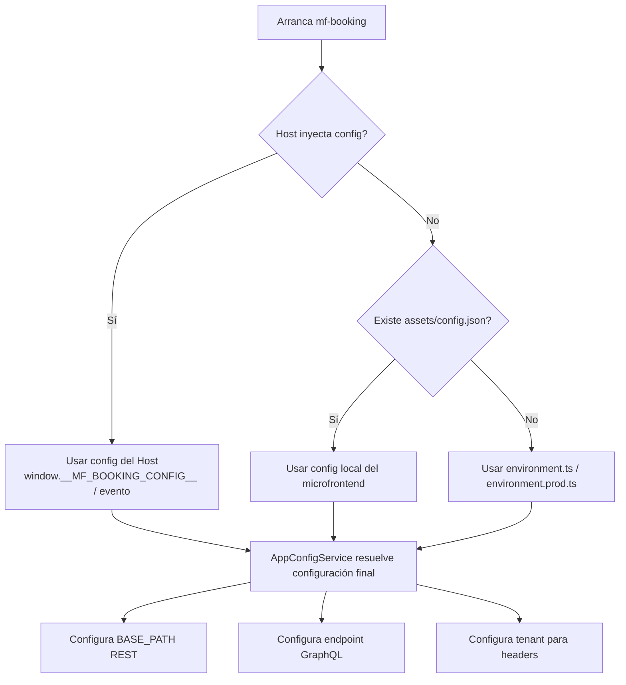
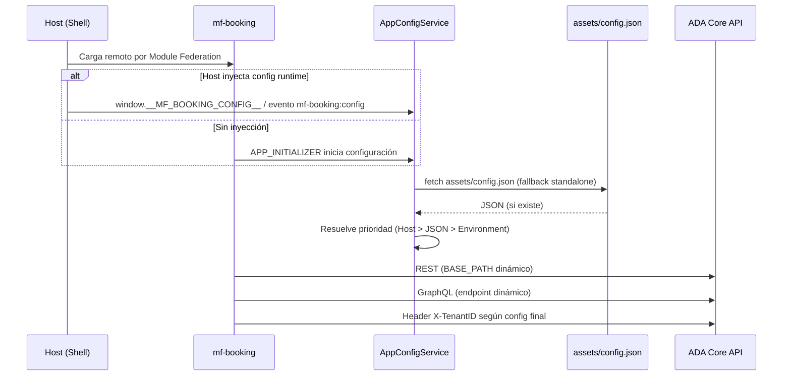

# Microfrontend Config Architecture (Frontend)

Este documento resume la estrategia de configuración para los microfrontends en `arcadia/frontend`.

## Objetivo

Tener microfrontends **autónomos** (standalone) pero también **alineados por el host** cuando se integran por Module Federation.

## Patrón adoptado (híbrido)

Orden de prioridad de configuración:

1. **Host runtime config** (inyectada en tiempo de ejecución)
2. **`assets/config.json` del microfrontend** (fallback standalone)
3. **`environment.ts` / `environment.prod.ts`** (fallback final)

Esto evita acoplar un remoto al `environment` del host y permite despliegues independientes.

## Implementación en `mf-booking`

## Comandos de arranque local (rápido)

Orden recomendado: **Host (arcadiaFront) → mf-entity-crud → mf-booking**.

### 1) Host shell `arcadiaFront` (puerto 4200)

```bash
cd /home/sotobotero/workspace/repositories/personal/arcadia/frontend/arcadiaFront
ng serve --port 4200
```

### 2) Microfrontend `mf-entity-crud` (puerto 4201)

```bash
cd /home/sotobotero/workspace/repositories/personal/arcadia/frontend/mf-entity-crud
ng serve --port 4201
```

### 3) Microfrontend `mf-booking` (puerto 4202)

```bash
cd /home/sotobotero/workspace/repositories/personal/arcadia/frontend/mf-booking
ng serve --port 4202
```

### URLs de validación rápida

- Host: `http://localhost:4200`
- Remote `mf-entity-crud`: `http://localhost:4201/remoteEntry.js`
- Remote `mf-booking`: `http://localhost:4202/remoteEntry.js`

### Fuentes de configuración

- `src/environments/environment.ts`
- `src/environments/environment.prod.ts`
- `src/assets/config.json`
- Inyección host vía:
  - `window.__MF_BOOKING_CONFIG__`
  - evento `mf-booking:config`

### Servicio central

- `src/app/core/config/app-config.service.ts`

Responsabilidades:

- Resolver configuración efectiva (`adaCoreBaseUrl`, `graphqlEndpoint`, `tenantId`)
- Cargar `assets/config.json`
- Aplicar override del host (global/evento)

### Inicialización temprana

- `src/app/app.module.ts` usa `APP_INITIALIZER` para cargar config antes de usar servicios HTTP.

### Consumo

- REST base path dinámico: `src/app/booking/booking.module.ts` (`BASE_PATH`)
- GraphQL endpoint + tenant: `src/app/shared/graphql/ada-graphql-client.service.ts`
- Tenant header para REST/GraphQL: `src/app/shared/interceptors/booking-auth.interceptor.ts`
- Servicios de dominio (ej. diary): leen tenant desde `AppConfigService`

## Ejemplo de inyección desde Host

```ts
window.__MF_BOOKING_CONFIG__ = {
  adaCoreBaseUrl: 'http://localhost:8080/ADA_ENTERPISE_CORE',
  graphqlEndpoint: 'http://localhost:8080/ADA_ENTERPISE_CORE/graphql',
  tenantId: 'default_tenant'
};

window.dispatchEvent(new CustomEvent('mf-booking:config', {
  detail: {
    adaCoreBaseUrl: 'http://localhost:8080/ADA_ENTERPISE_CORE',
    tenantId: 'default_tenant'
  }
}));
```

## Buenas prácticas

- No hardcodear URLs/tenant en servicios de negocio.
- No modificar código autogenerado (`api-generated`).
- Mantener contrato de config pequeño, tipado y estable.
- No poner secretos en frontend (solo configuración pública).

## Diagrama (Mermaid)



## Diagrama Secuencia (Mermaid)



## Snippet de inicialización en Host (Runtime Injection)

Sí: este es el snippet que necesita el Host para inyectar configuración runtime al remoto.

> **Tip de Oro (Producción):** no escribir estos valores a mano en el código del Host.
> El Host debe leerlos desde su propio `config.json` (o variables de entorno inyectadas al contenedor)
> y luego poblar `window.__MF_BOOKING_CONFIG__` dinámicamente al cargar.

```html
<script>
  // Debe ejecutarse ANTES de cargar el remoteEntry del microfrontend
  window.__MF_BOOKING_CONFIG__ = {
    adaCoreBaseUrl: 'http://localhost:8080/ADA_ENTERPISE_CORE',
    graphqlEndpoint: 'http://localhost:8080/ADA_ENTERPISE_CORE/graphql',
    tenantId: 'default_tenant'
  };

  // Opcional: actualización dinámica posterior a la carga
  window.dispatchEvent(new CustomEvent('mf-booking:config', {
    detail: {
      adaCoreBaseUrl: 'http://localhost:8080/ADA_ENTERPISE_CORE',
      tenantId: 'default_tenant'
    }
  }));
</script>
```

## TODO (Docker / despliegue)

- [ ] Implementar este runtime injection en el Host antes de cargar `mf-booking`.
- [ ] Cambiar URLs hardcodeadas por variables de entorno del contenedor (Host).
- [ ] Definir valores por entorno (`dev`, `staging`, `prod`) sin recompilar el remoto.
- [ ] Validar que `tenantId` venga desde configuración de despliegue (no fijo en código).
