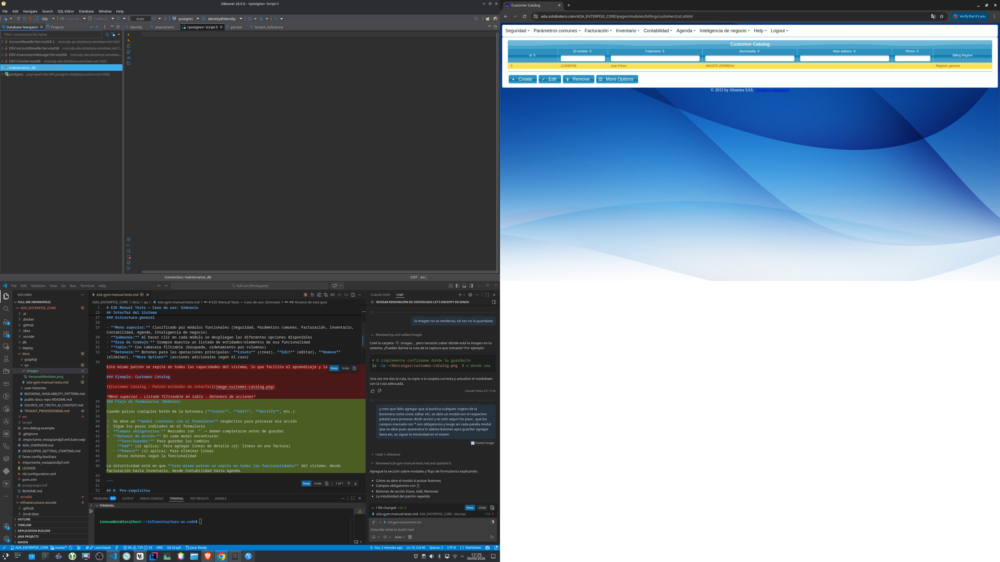
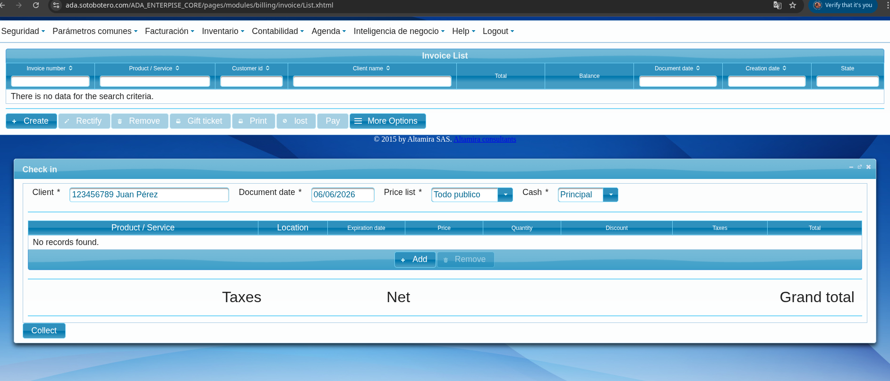

# E2E Manual Tests — Caso de uso: Gimnasio

> Ejecutar en orden. Cada sección asume que la anterior se completó.  
> URL staging: `https://ada.sotobotero.com/ADA_ENTERPISE_CORE`

## Alcance de esta guía

Esta guía usa un **caso hipotético de gimnasio** para facilitar las pruebas E2E.

El sistema no está limitado a gimnasios: soporta casos de negocio con:
- solo **servicios**,
- solo **productos**,
- **productos compuestos** (producción),
- o combinaciones mixtas (productos físicos + servicios).

Ejemplo mixto para este caso:
- servicio mensual facturable mes a mes (contrato),
- producto comodín sin costo (por ejemplo, tarjeta de acceso),
- producto físico opcional con inventario (por ejemplo, suplemento vitamínico).

---

## Interfaz del Sistema

El sistema es **muy intuitivo** y sigue un patrón consistente en todas sus funcionalidades:

### Estructura general

- **Menú superior:** Clasificado por módulos funcionales (Seguridad, Parámetros comunes, Facturación, Inventario, Contabilidad, Agenda, Inteligencia de negocio)
- **Submenús:** Al hacer clic en cada módulo se despliegan las diferentes opciones disponibles
- **Área de trabajo:** Siempre muestra un listado de entidades/elementos de esa funcionalidad
- **Tabla:** Con cabecera filtrable (búsqueda, ordenamiento por columnas)
- **Botonera:** Botones para las operaciones principales: **Create** (crear), **Edit** (editar), **Remove** (eliminar), **More Options** (acciones adicionales según el caso)

### Flujo de formularios (Modales)

Cuando pulsas cualquier botón de la botonera (**Create**, **Edit**, **Rectify**, etc.):

1. Se abre un **modal (ventana) con el formulario** respectivo para procesar esa acción
2. Sigue los pasos indicados en el formulario
3. **Campos obligatorios:** Marcados con `*` — deben completarse antes de guardar
4. **Botones de acción:** En cada modal encontrarás:
   - **Save/Guardar:** Para guardar los cambios
   - **Add** (si aplica): Para agregar líneas de detalle (ej: líneas en una factura)
   - **Remove** (si aplica): Para eliminar líneas
   - Otros botones según la funcionalidad

La intuitividad está en que **este mismo patrón se repite en todas las funcionalidades** del sistema: desde Facturación hasta Inventario, desde Contabilidad hasta Agenda.

---

## 0. Pre-requisitos

| Requisito | Verificar |
|---|---|
| Backend disponible | `https://ada.sotobotero.com/ADA_ENTERPISE_CORE` |
| Tenant activo en DB | `SELECT id, name, url FROM public.datasources WHERE name = '<tu-tenant>';` (DB `ada_master`) |
| Usuario administrador/base activo | `SELECT id, login, role, status FROM public.user_system WHERE id IN (1,2);` (DB del tenant) y al menos uno con `status=1` |
| Credenciales iniciales | usar las credenciales entregadas durante el alta/onboarding del tenant |

---

## 1. Login

1. Ir a `https://ada.sotobotero.com/ADA_ENTERPISE_CORE`
2. Ingresar las credenciales entregadas en el onboarding del tenant (usuario administrador/base activo).
3. **Verificar:** llega al dashboard sin error 401/403.

---

## 2. Configurar producto o servicio (según el caso)

> Solo la primera vez. Si ya existe el ítem, saltar a la sección 3.

Para este ejemplo (Gym) se usa un **servicio** de mensualidad.

> **📋 Características predefinidas en nuevos tenants**
> 
> Cuando se provisiona un nuevo tenant, el sistema genera automáticamente:
> - Líneas de producto
> - Grupos
> - Cajas
> - Ubicaciones
> - Listas de precios
> - *Etc.*
>
> **Objetivo:** agilizar la puesta en marcha.
>
> **Flexibilidad:** Todo es **completamente parametrizable**. Cada cliente puede:
> - Crear características propias
> - Modificar las existentes según su estructura organizativa
> - Coordinar migraciones de datos
> - Importar/exportar vía plantillas de Excel
>
> Esto puede hacerse antes, durante o después de iniciar operaciones.

**Ruta:** Parametros comunes → Productos → Nuevo

| Campo | Valor |
|---|---|
| Nombre | `Mensualidad Gym` |
| Tipo | Servicio |
| Precio | `120.000` (o el que aplique) |
| **Cíclico** | ✅ activado |
| Estado | `SERVICE_AVAILABLE` |

**Guardar.** Anotar el ID del producto (visible en la lista).

**Verificar:** el ítem aparece en lista con estado `SERVICE_AVAILABLE`.

---

## 3. Crear cliente

> Si ya existe el cliente, saltar a la sección 4.

**Ruta:** Facturación → Clientes → Nuevo

| Campo | Valor |
|---|---|
| Nombre | `Juan Pérez` (o cualquier nombre de prueba) |
| Correo | `juan@test.com` |
| Identificación | `123456789` |

**Guardar.** Anotar el ID del cliente.

---

## 4. Crear factura de inscripción + contrato

**Ruta:** Facturación → Facturas → botón crear

### 4.1 Cabecera de la factura

| Campo | Valor |
|---|---|
| Cliente | `Juan Pérez` |
| Fecha | Hoy |
| **Crear contrato** | ✅ activado (`makeContract = true`) |
| **Meses de permanencia** | `6` (o `0` para mes a mes sin permanencia) |

### 4.2 Línea de detalle

| Campo | Valor |
|---|---|
| Producto | `Mensualidad Gym` |
| Cantidad | `1` |
| Precio unitario | `120.000` |

> Nota: en otros casos de uso se puede facturar un producto físico, un servicio, o una combinación de ambos.

**Guardar factura.**

**Verificar:**
- Factura queda con estado activo/pagada.
- En Contratos (Clientes → Ver Cliente → Contratos) aparece un nuevo registro:
  - Estado: `CONTRACT_ACTIVE`
  - `monthsStay`: `6` (o lo que se ingresó)
  - `pendingMonths`: `6`
  - Producto: `Mensualidad Gym`
  - Producto cambia a `SERVICE_RENTED`

---

## 5. Simular facturación cíclica (ciclo mensual)

El scheduler corre diario automáticamente. Para forzarlo manualmente basta con avanzar la fecha del sistema un mes **o** invocar el endpoint de debug (si está habilitado).

> En entorno local, la fecha se puede ajustar en el `billingDate` del servicio si hay un override de `Clock`, o esperando al día equivalente del mes siguiente.

**Verificar tras el ciclo:**
- Aparece una nueva factura generada automáticamente para `Juan Pérez`.
- `lastInvoice` del contrato apunta a la nueva factura.
- `pendingMonths` decrementó en 1 (pasa de `6` a `5`).

---

## 6. Finalizar contrato

**Ruta:** Facturación → Clientes → `Juan Pérez` → Contratos → Seleccionar contrato → Finalizar

**Verificar:**
- Estado del contrato: `CONTRACT_FINISHED`
- `pendingMonths`: `0`
- Producto `Mensualidad Gym` vuelve a `SERVICE_AVAILABLE`

---

## 7. Caso borde: contrato sin permanencia (monthsStay = 0)

Repetir sección 4 pero con **Meses de permanencia = 0**.

**Verificar:**
- Contrato creado normalmente.
- El ciclo automático **no** genera nuevas facturas (sin meses pendientes).
- Útil para servicio de día, VoD, clase suelta.

---

## 8. Caso borde: intento de duplicado

Crear una segunda factura para `Juan Pérez` con **el mismo producto** en la misma fecha.

**Verificar:**
- Si el producto ya tiene un contrato activo (`SERVICE_RENTED`), el sistema debe advertir o rechazar la segunda creación de contrato (guard de idempotencia).
- No se crea un contrato duplicado.

---

## Resumen de estados esperados

| Momento | Estado contrato | Estado producto |
|---|---|---|
| Antes de factura | — | `SERVICE_AVAILABLE` |
| Factura creada con `makeContract=true` | `CONTRACT_ACTIVE` | `SERVICE_RENTED` |
| Ciclo mensual ejecutado | `CONTRACT_ACTIVE` | `SERVICE_RENTED` |
| Contrato finalizado | `CONTRACT_FINISHED` | `SERVICE_AVAILABLE` |
