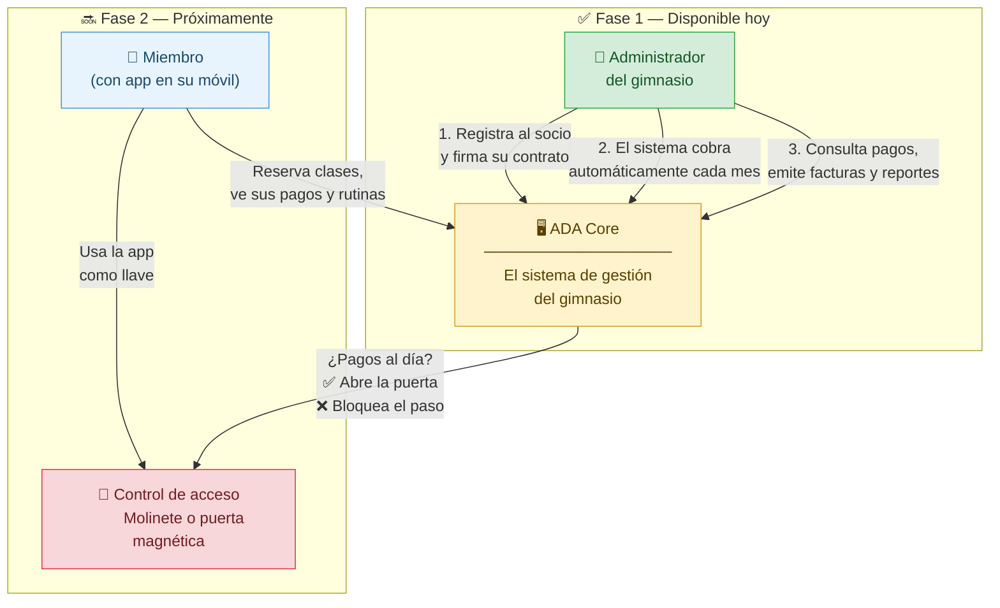
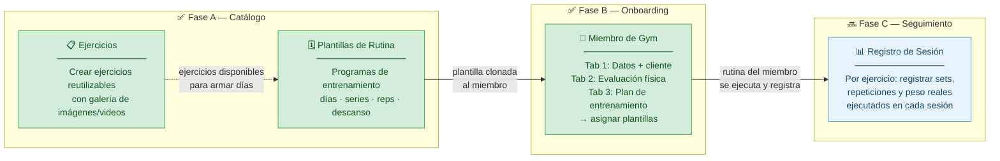
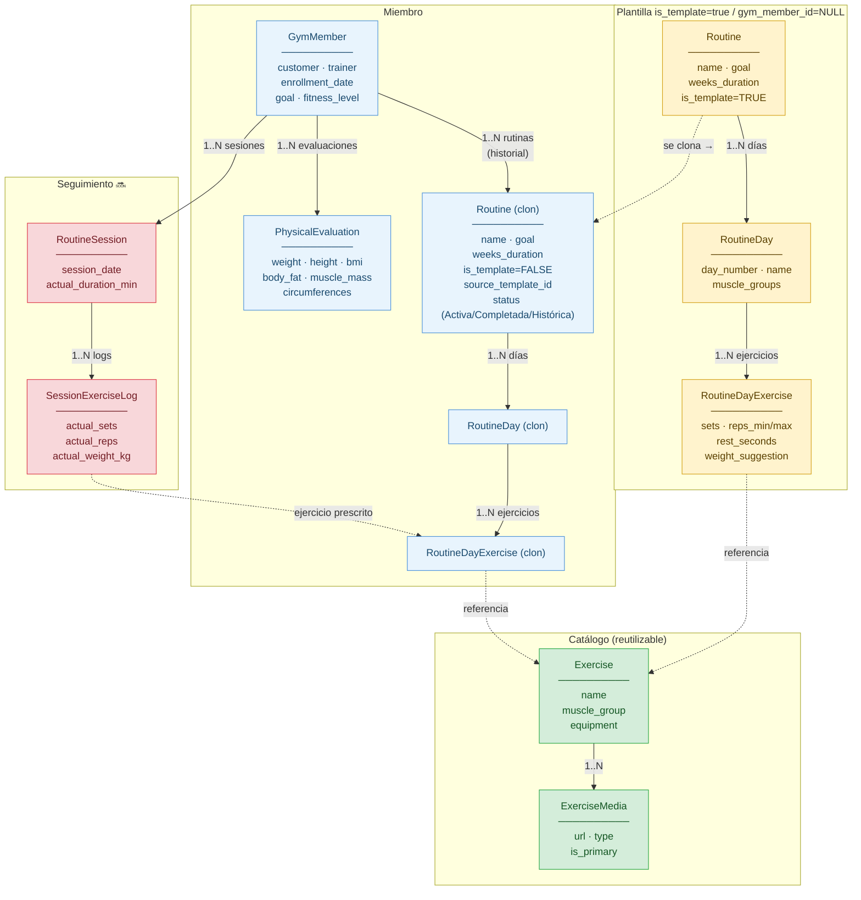
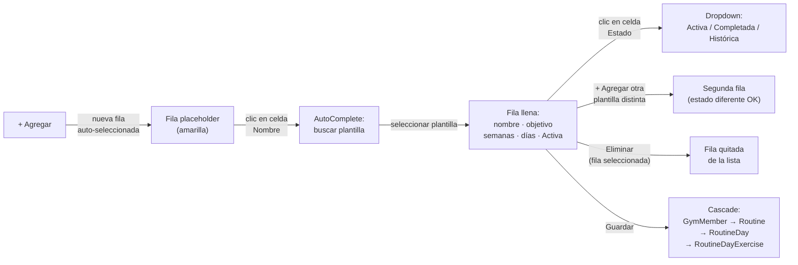

# E2E Manual Tests — Caso de uso: Gimnasio

> Ejecutar en orden. Cada sección asume que la anterior se completó.  
> URL staging: `https://ada.sotobotero.com/ADA_ENTERPISE_CORE`


## ¿Qué problema resuelve este sistema?

Un gimnasio necesita gestionar sus socios, cobrarles mes a mes y controlar quién puede entrar a las instalaciones. ADA Core cubre todo ese ciclo — desde el momento en que una persona se inscribe hasta que paga, renueva o cancela su membresía.



**En resumen:**
- **Fase 1** — El administrador lleva todo desde el sistema web: altas, contratos, cobros y facturación.
- **Fase 2** — El socio tiene una app en su móvil que le sirve de llave de acceso al gimnasio y le permite reservar clases, consultar su plan de entrenamiento y revisar sus pagos. La app consulta a ADA Core en tiempo real: si el socio está al día, la puerta se abre; si no, el acceso queda bloqueado.

---

## Flujo del módulo Gym — Cuatro fases



---

## Modelo de datos — Relaciones clave



**Regla de clonación:** al asignar una plantilla a un miembro, el sistema crea copias independientes de `Routine`, todos sus `RoutineDay` y todos sus `RoutineDayExercise`. La plantilla original queda intacta. Personalizar la rutina del miembro no afecta la plantilla.

---

## Alcance de esta guía

Esta guía usa un **caso hipotético de gimnasio** para facilitar las pruebas E2E.

El sistema no está limitado a gimnasios: soporta casos de negocio con:
- solo **servicios**, solo **productos**, **productos compuestos** (producción), o combinaciones mixtas.

Ejemplo mixto para este caso:
- servicio mensual facturable mes a mes (contrato),
- producto comodín sin costo (tarjeta de acceso),
- producto físico opcional con inventario (suplemento vitamínico).

---

## Interfaz del Sistema

El sistema sigue un patrón consistente en todas sus funcionalidades:

### Estructura general

- **Menú superior:** Clasificado por módulos funcionales
- **Área de trabajo:** Listado de entidades con cabecera filtrable
- **Botonera:** **Crear**, **Editar**, **Eliminar**, opciones adicionales según el caso

### Flujo de formularios (Modales)

1. Pulsar **Crear** o **Editar** → abre modal con el formulario
2. Campos obligatorios marcados con `*`
3. **Guardar** aplica todos los cambios de una sola vez (incluyendo tablas internas del formulario)
4. Tablas dentro del modal (ej: días, ejercicios, rutinas): los botones **+ Agregar** y **Eliminar** operan en memoria — nada se persiste hasta pulsar **Guardar**

---

## 0. Pre-requisitos

| Requisito | Verificar |
|---|---|
| Backend disponible | `https://ada.sotobotero.com/ADA_ENTERPISE_CORE` |
| Tenant activo en DB | `SELECT id, name FROM public.datasources WHERE name = '<tu-tenant>';` (DB `ada_master`) |
| Usuario administrador activo | `SELECT id, login, status FROM public.user_system WHERE id IN (1,2);` (DB del tenant) |
| Migraciones gym aplicadas | `034` al `058` en default_tenant; `016` y `017` en ada_master |

---

## 1. Login

1. Ir a `https://ada.sotobotero.com/ADA_ENTERPISE_CORE`
2. Completar **Tenant ID**, **Usuario** y **Contraseña**
3. **Verificar:** Llega al dashboard sin error 401/403.

---

## 2. Configurar producto o servicio

> Solo la primera vez. Si ya existe el ítem, saltar a la sección 3.

**Ruta:** Parametros comunes → Productos → Nuevo

| Campo | Valor |
|---|---|
| Nombre | `Mensualidad Gym` |
| Tipo | Servicio |
| Precio | `120.000` |
| **Cíclico** | ✅ activado |
| Estado | `SERVICE_AVAILABLE` |

**Verificar:** el ítem aparece en lista con estado `SERVICE_AVAILABLE`.

---

## 3. Crear cliente

**Ruta:** Facturación → Clientes → Nuevo

| Campo | Valor |
|---|---|
| Nombre | `Juan Pérez` |
| Correo | `juan@test.com` |
| Identificación | `123456789` |

---

## 4. Crear factura de inscripción + contrato

**Ruta:** Facturación → Facturas → Crear

| Campo | Valor |
|---|---|
| Cliente | `Juan Pérez` |
| Producto/servicio | `Mensualidad Gym` |
| **Crear contrato** | ✅ activado |
| **Meses de permanencia** | `6` |

**Verificar:**
- Factura guardada con estado activo.
- En Contratos: estado `CONTRACT_ACTIVE`, `pendingMonths = 6`, producto pasa a `SERVICE_RENTED`.

---

## 5. Simular facturación cíclica

El scheduler corre automáticamente a las 3:00 AM UTC. Para forzarlo manualmente:

### Opción A — Endpoint REST

```bash
curl -X POST http://localhost:8080/ADA_ENTERPISE_CORE/restapi/v1/billing/trigger-cycle
```

### Opción B — Ajustar BD

```sql
-- Ver estado de contratos activos
SELECT ci.id, bc.start_day_billing, EXTRACT(DAY FROM NOW())::integer AS today, i.invoice_date
FROM billing.contract_items ci
JOIN billing.account a ON a.customer = ci.customer AND a.type = 1
JOIN billing.billing_cicle bc ON bc.id = a.billing_cycle
JOIN billing.invoice i ON i.id = ci.last_invoice
WHERE ci.pending_month > 0;

-- Ajustar start_day_billing al día de hoy
UPDATE billing.billing_cicle SET start_day_billing = EXTRACT(DAY FROM NOW())::integer WHERE id = <ID>;

-- Retrofechar última factura (anti-duplicado)
UPDATE billing.invoice SET invoice_date = invoice_date - INTERVAL '1 month' WHERE id = <ID>;
```

**Verificar:** Nueva factura generada, `pendingMonths` decrementó en 1.

---

## 6. Finalizar contrato

**Ruta:** Facturación → Clientes → `Juan Pérez` → Contratos → Finalizar

**Verificar:** Estado `CONTRACT_FINISHED`, `pendingMonths = 0`, producto vuelve a `SERVICE_AVAILABLE`.

---

## 7. Caso borde: contrato sin permanencia

Repetir sección 4 con **Meses de permanencia = 0**.

**Verificar:** Contrato creado. El ciclo automático no genera nuevas facturas.

---

## 8. Caso borde: intento de duplicado

Crear segunda factura para `Juan Pérez` con el mismo producto activo.

**Verificar:** El sistema advierte o rechaza. No se crea contrato duplicado.

---

## Resumen de estados esperados

| Momento | Estado contrato | Estado producto |
|---|---|---|
| Antes de factura | — | `SERVICE_AVAILABLE` |
| Factura con `makeContract=true` | `CONTRACT_ACTIVE` | `SERVICE_RENTED` |
| Ciclo mensual ejecutado | `CONTRACT_ACTIVE` | `SERVICE_RENTED` |
| Contrato finalizado | `CONTRACT_FINISHED` | `SERVICE_AVAILABLE` |

---

---

# Módulo Gym — Gestión de Entrenamiento

> **Ruta de acceso:** Salud y Bienestar → (submenú según función)

---

## 9. Fase A — Catálogo de Ejercicios ✅

> **Ruta:** Salud y Bienestar → Ejercicios

El catálogo es la base de todo. Los ejercicios aquí creados se reutilizan en múltiples plantillas y en las rutinas de los miembros (siempre por referencia, nunca duplicados).

### 9.1 Crear ejercicio

1. **Salud y Bienestar → Ejercicios → Nuevo ejercicio**
2. Completar el formulario:

| Campo | Valor de ejemplo | Obligatorio |
|---|---|---|
| Nombre | `Press de banca` | ✅ |
| Grupo muscular | `Pecho, tríceps, deltoides anterior` | No |
| Equipamiento | `Barra + banco` | No |
| Activo | ✅ marcado | — |
| Descripción | `Ejercicio compuesto de empuje horizontal` | No |

3. **Tab Media (galería):**
   - Pulsar **+ Agregar** → fila nueva aparece seleccionada
   - Hacer clic en la celda **URL** → ingresar la URL de imagen o video
   - Hacer clic en la celda **Tipo** → seleccionar `IMAGE` o `VIDEO`
   - Si hay varias, pulsar el botón ★ en la fila principal para marcarla como primaria
   - Para quitar una, seleccionarla y pulsar **Eliminar**
4. Pulsar **Guardar** (fuera del tabView)

**Verificar:**
- Aparece en la lista con nombre, grupo muscular, equipamiento y conteo de media.
- Al editar, la galería muestra las URLs ingresadas.

### 9.2 Datos de prueba pre-cargados

```sql
SELECT name, muscle_group, equipment FROM gym.exercise ORDER BY name;
```

Los ejercicios de las plantillas "Adaptación General" y "Fuerza Básica — 5x5" deben aparecer.

---

## 10. Fase A — Gestión de Plantillas de Rutina ✅

> **Ruta:** Salud y Bienestar → Rutinas

Las plantillas son el "programa maestro": `is_template = TRUE`, sin miembro asignado. Al onboardear un miembro, el sistema las **clona** — la plantilla original nunca se modifica.

### 10.1 Plantillas pre-cargadas

```sql
SELECT r.name, r.weeks_duration, t.description AS goal, COUNT(rd.id) AS dias
FROM gym.routine r
LEFT JOIN gym.routine_day rd ON rd.routine_id = r.id
LEFT JOIN public.type t ON t.id = r.goal_id
WHERE r.is_template = true
GROUP BY r.id, r.name, r.weeks_duration, t.description;
```

### 10.2 Crear plantilla

1. **Salud y Bienestar → Rutinas → Crear**
2. **Tab 1 — Información:**

| Campo | Valor de ejemplo | Obligatorio |
|---|---|---|
| Nombre | `Fuerza Básica — Powerlifting` | ✅ |
| Semanas | `12` | No |
| Objetivo | `MUSCLE_GAIN` | No |
| Entrenador | (empleado del sistema) | No |

3. **Tab 2 — Días y ejercicios:**
   - Pulsar **+ Agregar día** → aparece fieldset "Día 1" (seleccionado automáticamente)
   - Completar Nombre del día, músculos objetivo, duración estimada
   - Dentro del día, pulsar **+ Agregar ejercicio** → fila nueva aparece seleccionada
   - Hacer clic en la celda **Ejercicio** → autoComplete → seleccionar del catálogo
   - Completar los parámetros: Series, Reps mín/máx, Descanso (seg), Sugerencia de peso
   - Repetir para más ejercicios y más días
   - Los días se renumeran automáticamente al eliminar uno
4. Pulsar **Guardar**

**Verificar:**
- La plantilla aparece en la lista.
- Al editar, se cargan todos los días y ejercicios con sus parámetros.

### 10.3 Casos borde — Plantillas

| Caso | Resultado esperado |
|---|---|
| Plantilla sin días → Guardar | Se guarda sin días; Tab 2 muestra cero fieldsets |
| Día sin ejercicios → Guardar | El día persiste vacío |
| Eliminar ejercicio del medio | Los restantes se conservan con su `sort_order` actualizado |
| Eliminar un día intermedio → Guardar | Los días restantes se renumeran sin huecos |

---

## 11. Fase B — Miembros de Gym (onboarding + plan de entrenamiento) ✅

> **Ruta:** Salud y Bienestar → Miembros de Gym

El formulario de miembro tiene tres tabs. **Guardar** al final del modal persiste todo de una sola vez — incluyendo la evaluación física y todas las rutinas asignadas.

### 11.1 Crear miembro

1. **Salud y Bienestar → Miembros de Gym → Crear**
2. **Tab 1 — Datos del Miembro:**

| Campo | Descripción |
|---|---|
| Cliente | Buscar por nombre o cédula (autoComplete). Si no existe: pulsar **+ Crear cliente** o Enter en el campo para abrir el formulario de cliente sin cerrar el modal actual |
| Fecha de inscripción | Hoy (auto-completado) |
| Entrenador | Empleado del sistema (opcional) |
| Objetivo | Catálogo GYM_GOAL (ej: Ganancia muscular) |
| Nivel de condición | Catálogo GYM_FITNESS_LEVEL (ej: Principiante) |
| Estado | Estado del miembro en el sistema |

3. **Tab 2 — Evaluación Física:**

Ingresar medidas antropométricas, composición corporal y circunferencias. Todos opcionales al crear; se pueden completar después.

4. **Tab 3 — Plan de Entrenamiento:**

Ver sección 11.2.

5. Pulsar **Guardar** (fuera del tabView, en la barra inferior del modal)

### 11.2 Asignar rutinas — Tab 3



**Pasos detallados:**

1. Ir a **Tab 3 — Plan de Entrenamiento**
2. Pulsar **+ Agregar** → aparece una fila vacía seleccionada (amarilla)
3. Hacer clic en la celda **Nombre** de esa fila → aparece el autoComplete de plantillas
4. Escribir al menos 1 carácter y seleccionar la plantilla deseada
5. La fila se llena automáticamente: nombre, objetivo, semanas, número de días, estado = **Activa**
6. (Opcional) Hacer clic en la celda **Estado** → seleccionar Completada o Histórica si aplica
7. (Opcional) Repetir desde el paso 2 para agregar más plantillas
8. (Opcional) Seleccionar una fila y pulsar **Eliminar** para quitarla
9. (Opcional) Seleccionar una fila existente y pulsar **Personalizar rutina** → abre el editor completo de esa rutina del miembro (días, ejercicios, parámetros)
10. Pulsar **Guardar** → todo persiste en un solo paso

**Reglas de la tabla:**

| Regla | Detalle |
|---|---|
| Una plantilla puede asignarse varias veces | Siempre que cada asignación tenga un estado diferente |
| Misma plantilla + mismo estado = bloqueado | El sistema muestra error al Guardar |
| Diferentes plantillas con el mismo estado | Permitido (ej: dos rutinas distintas como Activa) |
| Eliminar fila nueva (sin guardar) | Solo la quita de la lista; sin impacto en DB |
| Eliminar fila guardada (id > 0) | Se elimina de DB al Guardar (orphanRemoval) |

### 11.3 Verificación en DB

```sql
-- Rutinas asignadas a un miembro
SELECT r.name, r.is_template, s.name AS status,
       r.start_date, r.source_template_id,
       COUNT(DISTINCT rd.id) AS dias,
       COUNT(rde.id) AS ejercicios
FROM gym.routine r
JOIN gym.gym_member gm ON gm.id = r.gym_member_id
LEFT JOIN gym.routine_day rd ON rd.routine_id = r.id
LEFT JOIN gym.routine_day_exercise rde ON rde.routine_day_id = rd.id
LEFT JOIN public.status s ON s.id = r.status
WHERE r.is_template = false
  AND r.gym_member_id = <ID_MIEMBRO>
GROUP BY r.id, r.name, r.is_template, s.name, r.start_date, r.source_template_id
ORDER BY r.start_date;
```

```sql
-- Verificar que la plantilla original quedó intacta
SELECT r.id, r.name, r.is_template, r.gym_member_id
FROM gym.routine r
WHERE r.is_template = true;
-- gym_member_id debe ser NULL en todas las plantillas
```

### 11.4 Casos borde — Miembros

| Caso | Resultado esperado |
|---|---|
| Guardar sin cliente | Error: "Busque y seleccione un cliente antes de guardar" |
| Agregar misma plantilla con mismo estado → Guardar | Error: "La rutina '...' ya tiene estado '...'. No se puede duplicar." |
| Agregar misma plantilla con estado diferente → Guardar | Permitido; ambas filas persisten |
| Agregar fila → no seleccionar plantilla → Guardar | La fila placeholder se ignora (nombre null) |
| Editar miembro → cambiar estado de rutina existente → Guardar | Estado actualizado en DB; historial de otras rutinas intacto |
| Editar miembro → eliminar rutina existente → Guardar | Rutina eliminada de DB (con todos sus días y ejercicios) |

---

## 12. Fase C — Registro de sesión ejecutada 🔜

> **Estado:** Pendiente de implementación  
> **Ruta prevista:** Salud y Bienestar → Seguimiento → Registrar sesión

### Modelo de datos

| Tabla | Descripción |
|---|---|
| `gym.routine_session` | Cabecera: miembro, fecha, duración real, notas |
| `gym.session_exercise_log` | Por ejercicio: `routine_day_exercise_id` (el prescrito), sets/reps/peso reales |

### Flujo previsto

1. Seleccionar el miembro y la rutina activa
2. Seleccionar el día a ejecutar (Día 1, 2, 3…)
3. Por cada ejercicio: se muestra lo prescrito → ingresar sets/reps/peso reales
4. Guardar: crea `routine_session` + N registros `session_exercise_log`

### Verificación prevista

```sql
SELECT rs.session_date, rs.actual_duration_minutes,
       e.name AS ejercicio,
       sel.actual_sets, sel.actual_reps, sel.actual_weight_kg
FROM gym.routine_session rs
JOIN gym.session_exercise_log sel ON sel.routine_session_id = rs.id
JOIN gym.routine_day_exercise rde ON rde.id = sel.routine_day_exercise_id
JOIN gym.exercise e ON e.id = rde.exercise_id
WHERE rs.gym_member_id = <ID_MIEMBRO>
ORDER BY rs.session_date DESC;
```

---

## Apéndice — Verificación de datos en DB

### Estado general del módulo gym

```sql
SELECT 'exercises'       AS entity, COUNT(*) FROM gym.exercise
UNION ALL
SELECT 'exercise_media'  AS entity, COUNT(*) FROM gym.exercise_media
UNION ALL
SELECT 'templates'       AS entity, COUNT(*) FROM gym.routine WHERE is_template = true
UNION ALL
SELECT 'member_routines' AS entity, COUNT(*) FROM gym.routine WHERE is_template = false
UNION ALL
SELECT 'routine_days'    AS entity, COUNT(*) FROM gym.routine_day
UNION ALL
SELECT 'day_exercises'   AS entity, COUNT(*) FROM gym.routine_day_exercise
UNION ALL
SELECT 'members'         AS entity, COUNT(*) FROM gym.gym_member
UNION ALL
SELECT 'evaluations'     AS entity, COUNT(*) FROM gym.physical_evaluation;
```

### Ejercicios por plantilla

```sql
SELECT r.name AS plantilla, rd.day_number, rd.name AS dia,
       e.name AS ejercicio, rde.sets, rde.reps_min, rde.reps_max,
       rde.rest_seconds, rde.weight_suggestion
FROM gym.routine r
JOIN gym.routine_day rd ON rd.routine_id = r.id
JOIN gym.routine_day_exercise rde ON rde.routine_day_id = rd.id
JOIN gym.exercise e ON e.id = rde.exercise_id
WHERE r.is_template = true
ORDER BY r.name, rd.day_number, rde.sort_order;
```

### Verificar permisos de módulo

```sql
SELECT v.name, v.path, p.name AS permission
FROM public.view v
JOIN public.permission p ON p.view_id = v.id
WHERE v.path LIKE '%gym%'
ORDER BY v.path;
```
