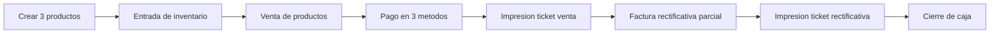
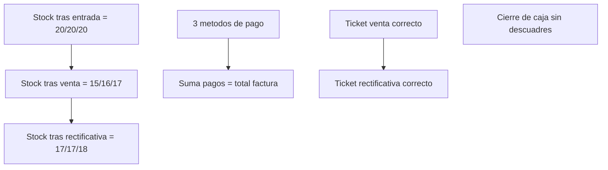

# E2E Manual Tests — Happy Path Inventario y Facturacion

> Ejecutar en orden. Cada paso asume que el anterior fue exitoso.
> Caso orientado a QA funcional manual (sin pruebas de carga ni escenarios de error).

---

## Objetivo

Validar de punta a punta:

- alta de productos,
- entrada de inventario,
- venta con pago mixto (3 metodos),
- devolucion parcial por factura rectificativa,
- impresion de tickets,
- cierre de caja con totales consistentes.

---

## Pre-requisito critico (Company Profile)

Antes de ejecutar este E2E, confirmar en Company Profile:

- Tipo de inventario (`priodicalinventory`): periodico o permanente.
- Metodo de costo (`costing_method`): 1 promedio ponderado, 2 costo maximo, 3 costo minimo.

Referencia funcional: [Reglas de costo (resumen)](../INVENTORY_MODULE.md#reglas-de-costo-resumen) en [docs/INVENTORY_MODULE.md](../INVENTORY_MODULE.md).

---

## Flujo General

---

## Datos de prueba

| Dato | Valor sugerido |
|---|---|
| Cliente | QA Cliente Inventario |
| Producto 1 | P-001 Proteina 1kg |
| Producto 2 | P-002 Creatina 300g |
| Producto 3 | P-003 Shaker |
| Entrada inicial | 20 unidades por producto |
| Venta | P-001 x5, P-002 x4, P-003 x3 |
| Devolucion parcial | P-001 x2, P-002 x1, P-003 x1 |

Stock esperado:

- Despues de entrada: 20 / 20 / 20
- Despues de venta: 15 / 16 / 17
- Despues de rectificativa parcial: 17 / 17 / 18

---

## Pasos E2E

### 1) Crear 3 productos inventariables

Ruta: Inventario -> Productos -> Crear

Validar:

- Los 3 productos quedan activos.
- Los 3 productos aparecen en listado.

### 2) Registrar entrada de inventario

Ruta: Inventario -> Factura compra o Albaran de entrada

Accion:

- Registrar entrada de 20 unidades para cada producto.

Validar:

- Stock: 20/20/20.
- Existe movimiento de entrada para cada item.

### 3) Registrar venta

Ruta: Facturacion -> Facturas -> Crear

Accion:

- Vender P-001 x5, P-002 x4, P-003 x3.

Validar:

- Factura guardada correctamente.
- Movimiento de salida por cada producto.
- Stock: 15/16/17.

### 4) Pagar con 3 metodos

Ruta: popup/metodo de pago de la factura

Accion:

- Registrar 3 lineas de pago (ejemplo: efectivo + tarjeta + transferencia).

Validar:

- Existen 3 lineas de pago en la factura.
- Suma de pagos = total de factura.

### 5) Imprimir ticket de venta

Accion:

- Imprimir comprobante de la factura pagada.

Validar:

- Ticket legible.
- Total correcto.
- Se visualizan los metodos de pago.

### 6) Crear factura rectificativa parcial

Ruta: Facturacion -> Facturas -> Rectificar

Accion:

- Devolver solo una parte de lo vendido: P-001 x2, P-002 x1, P-003 x1.

Validar:

- Rectificativa creada.
- El inventario sube solo en lo devuelto.
- Stock final: 17/17/18.
- Existen movimientos de devolucion.

### 7) Imprimir ticket de rectificativa

Accion:

- Imprimir ticket/comprobante de la rectificativa.

Validar:

- Monto de devolucion correcto.
- Referencia visible a factura original (si aplica en formato).

### 8) Realizar cierre de caja

Ruta: Caja -> Cierre

Validar:

- El cierre contempla venta y rectificativa del caso.
- Totales por metodo de pago cuadran con los movimientos.
- Se genera reporte/comprobante de cierre sin error.

---

## Matriz de Control Rapida

---

## Criterio de Aceptacion

Se considera aprobado cuando:

- El inventario coincide en los 3 hitos (entrada, venta, devolucion parcial).
- Factura y rectificativa quedan persistidas y trazables.
- Pago mixto en 3 metodos queda guardado y visible en comprobantes.
- El cierre de caja finaliza sin descuadres.
